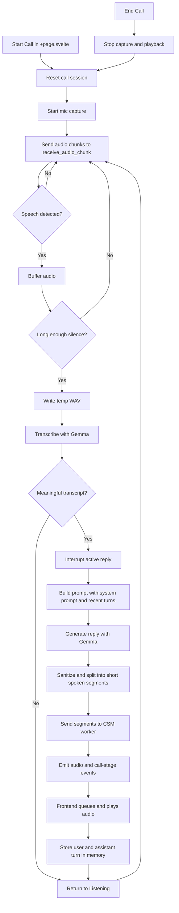

# OpenDuck

OpenDuck is a local voice-call prototype built with a Svelte frontend and a Tauri/Rust backend.
The frontend captures microphone audio and plays streamed speech output.
The backend uses Gemma for transcription and reply generation, and CSM for speech synthesis.

## Conversation Flow

1. The user starts a call in `src/routes/+page.svelte`. The frontend resets the session, starts microphone capture, and sets the UI to `Listening`.
2. Audio chunks are sent to `receive_audio_chunk` in `src-tauri/src/lib.rs`. The backend uses simple voice activity detection to buffer speech and treat a long enough silence as the end of a turn.
3. The buffered audio is written to a temporary WAV file and sent to Gemma for transcription. Empty or filler-only transcripts are ignored.
4. A valid transcript interrupts any active reply, so the user can barge in while the assistant is speaking.
5. The backend asks Gemma for a short spoken reply using the system prompt plus recent conversation history.
6. The reply is sanitized, split into short spoken segments, and sent to the CSM worker for text-to-speech generation.
7. The frontend listens for `csm-audio-start`, `csm-audio-chunk`, `csm-audio-done`, and `call-stage` events, queues the generated audio, plays it sequentially, and updates the visible call state.
8. Successful user and assistant turns are stored in memory with a rolling limit of 12 turns. Starting or ending a call clears that history and resets the session.

## Flowchart

## Key Files

- `src/routes/+page.svelte`: call UI, microphone capture, Tauri event listeners, playback queue, and call-stage state.
- `src-tauri/src/lib.rs`: voice activity detection, transcription, reply generation, conversation memory, and CSM worker orchestration.
