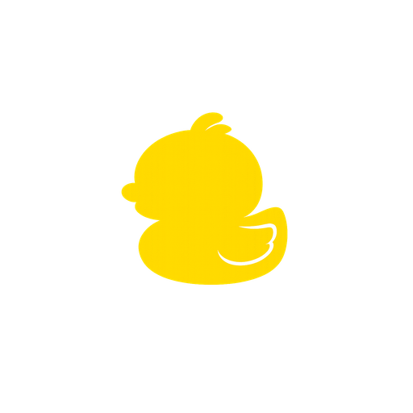

# OpenDuck

<p align="center">
  
</p>

Screen-aware, voice-first, local AI tool that stays lean and out of your away until you ask questions. Built for Apple Silicon (M1 or later).


[](https://img.shields.io/github/license/anslwy/openduck)

## Demo (In App)

https://github.com/user-attachments/assets/052aa02c-7be8-411e-9bb1-8f5a13515c47


## Demo (Screen-aware assistance)


https://github.com/user-attachments/assets/4603ce80-9b74-4b0e-8f8c-ff242f7bdc37


## Features

- **Real-Time Voice Interaction**: Chat with AI hands-free. Interrupt anytime you want like in a real conversation.
- **Screen-Aware Vision**: Capture screen regions or the full screen with shortcuts and let the AI see what you see.
- **Live Transcription & Subtitle**: Real-Time showing trascribtion and subtitle so you don't miss anything important.
- **Conversation Management**: Search, rename, resume, fork or delete any previous chat session from your local disk.
- **Portability**: Share your characters (Prompt, Avatar, Voice) easily with `.openduck` files.
- **Engineered for Efficiency**: Native macOS application built with Rust and Svelte, optimizing memory for AI models.
- **Low Latency**: Sub-second latency from the moment you stop talking to when the AI begins speaking.
- **Flexible Model Support**: Built-in MLX-optimized models or connect to Ollama, LM Studio, and OpenAI-compatible endpoints.

## Installation

### From Releases (recommended)

1. Go to [Releases](https://github.com/anslwy/openduck/releases)
2. Download the latest `openduck-beta-xxx.dmg` and move it to your Applications folder
3. Execute the following in your Terminal:
   ```bash
   xattr -d com.apple.quarantine /Applications/OpenDuck.app
   ```
4. Start OpenDuck from your Applications folder

### From source

```bash
git clone https://github.com/anslwy/openduck.git
cd openduck
./start.sh
```

## Technologies Used

- **[Tauri](https://tauri.app/)** - Framework for building tiny, blazing fast binaries for all major desktop platforms
- **[Svelte](https://svelte.dev/)** - Cybernetically enhanced web apps
- **[Rust](https://www.rust-lang.org/)** - A language empowering everyone to build reliable and efficient software
- **[MLX](https://github.com/ml-explore/mlx)** - Array framework for machine learning on Apple silicon

## Development

### Setup

```bash
git clone https://github.com/anslwy/openduck.git
cd openduck
./scripts/setup_python_env.sh
```

### Running the App

```bash
./start.sh
```

## License

This project is licensed under the MIT License - see the [LICENSE](LICENSE) file for details.

## Contributing

Contributions are welcome! Please feel free to submit a Pull Request.
