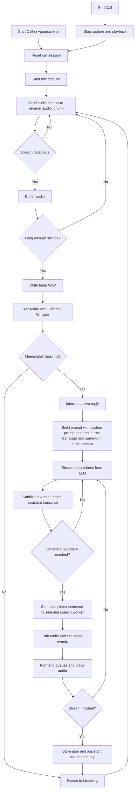

# OpenDuck

A local voice-call desktop application built for [rubberducking](https://en.wikipedia.org/wiki/Rubber_duck_debugging) on Apple Silicon.

The frontend captures microphone audio and plays streamed speech output.
The backend uses Gemma / Ollama for reply generation, a selectable STT backend for transcription, and a selectable speech backend for text-to-speech.


## Quick Start for Beta Version

1. Go to [Release](https://github.com/anslwy/openduck/releases)
2. Download the latest `openduck-beta-xxx.dmg` and move it to your Applications folder
3. Execute the following in your Terminal:
```
xattr -d com.apple.quarantine /Applications/OpenDuck.app
```
4. Start OpenDuck in your Applications folder

## Development

One-time installation for setting up the environment:
```
./scripts/setup_python_env.sh
```
Then execute the following the start the app:
```
./start.sh
```

## STT Models

The STT card in the app can switch between:

- `Gemma`: uses the loaded Gemma model for transcription. There is no separate STT model to download or load.
- `Whisper Large V3 Turbo`: runs through `mlx-audio` with `mlx-community/whisper-large-v3-turbo-asr-fp16`.

## Speech Models

The speech card in the app can switch between:

- `CSM Expressiva 1B`: the original MLX-based speech model, with optional quantization.
- `Kokoro-82M`: a lighter English TTS backend that runs through `mlx-audio` with the default `af_heart` voice from `mlx-community/Kokoro-82M-bf16`.
- `CosyVoice2-0.5B`: a reference-audio TTS backend that runs through `mlx-audio-plus` using the bundled sample voice.

Use the dropdowns in the STT and speech cards to choose the backends, then download and load the selected models before starting a call. The `Gemma` STT option does not need its own load step.
If you want to use Whisper, Kokoro, or CosyVoice2 in a fresh checkout, run `scripts/setup_python_env.sh` first so the dedicated STT and speech environments install the required `mlx-audio` / `mlx-audio-plus` dependencies.

## Conversation Flow

1. The user starts a call in `src/routes/+page.svelte`. The page coordinates the call state, starts microphone capture, and sets the UI to `Listening`, while the extracted home components render the model cards and popups.
2. Audio chunks are sent to `receive_audio_chunk` in `src-tauri/src/lib.rs`. The backend uses simple voice activity detection to buffer speech and treat a long enough silence as the end of a turn.
3. The buffered audio is written to a temporary WAV file and sent to the selected STT backend. Empty or filler-only transcripts are ignored.
4. A valid transcript interrupts any active reply, so the user can barge in while the assistant is speaking.
5. The backend asks Gemma for a short spoken reply using the system prompt, recent text conversation history, and the latest detected-turn transcript as the user's exact words, with the matching audio from that same turn attached only as supplemental context for tone, accent, pacing, and background conditions.
6. As Gemma emits text, the backend sanitizes it, updates the visible assistant transcript, and sends each completed sentence to the selected speech worker instead of waiting for the full reply.
7. The frontend listens for assistant text updates plus `csm-audio-start`, `csm-audio-queued`, `csm-audio-chunk`, `csm-audio-done`, and `call-stage` events, queues the generated audio, plays it sequentially, and updates the visible call state.
8. Once the stream finishes, any trailing partial sentence is synthesized, the speech worker context is finalized, and the text transcript plus assistant turn are stored in memory with a rolling limit of 24 turns. The raw audio is only used as live model context for that same turn, while the visible conversation log remains text-only. Starting or ending a call clears that history and resets the session.

## Flowchart



## Key Files

- `src/routes/+page.svelte`: top-level page coordinator for call state, audio capture, Tauri event listeners, playback queue, and model actions.
- `src/lib/components/home/*.svelte`: extracted UI sections for the model banners, contacts modal, and conversation popup.
- `src/lib/openduck/*.ts`: shared frontend types, config, contacts storage helpers, model preference helpers, and formatting utilities.
- `src/routes/home.css`: shared styles used by the page and extracted home components.
- `src-tauri/src/lib.rs`: backend runtime coordinator for commands, call flow, transcription, reply generation, conversation memory, and worker orchestration.
- `src-tauri/src/constants.rs`: shared backend constants for models, tray ids, event names, and runtime defaults.
- `src-tauri/src/model_variants.rs`: backend enums and lookup helpers for Gemma, STT, speech model, and voice selection.
- `src-tauri/src/frontend_events.rs`: serialized frontend event payloads plus emit helpers used by the Tauri backend.
- `src-tauri/resources/csm_stream.py`: shared speech worker entrypoint for CSM Expressiva 1B, Kokoro-82M, and CosyVoice2-0.5B.
- `src-tauri/resources/stt_stream.py`: dedicated Whisper STT worker entrypoint for `mlx-community/whisper-large-v3-turbo-asr-fp16`.
- `scripts/setup_python_env.sh`: bootstraps the Gemma environment plus separate CSM, Kokoro, CosyVoice, and Whisper STT environments.

## Project Structure

The app is now split so the entry files stay focused on orchestration:

- Frontend: `src/routes/+page.svelte` owns the page-level state machine, while `src/lib/components/home/` contains the repeated UI sections and `src/lib/openduck/` contains shared browser-side helpers.
- Backend: `src-tauri/src/lib.rs` remains the main Tauri entry/coordinator, while reusable constants, model-selection enums, and frontend event payloads/helpers live in dedicated Rust modules.

## FAQ

### Q: What is the minimum requirement for RAM?
### A: If you choose `Gemma-4-E2B` for both LLM and STT, then select `Kokoro-82M` for TTS you can get away with ~4GB

### Q: The model is too slow / My Mac does not have enough RAM / Even the E4B model is too dumb to be useful. What should I do?
### A: Use [Ollama](https://ollama.com) for the LLM. They support cloud models. Execute for example `ollama run gemma4:31b-cloud` in your Terminal. Then you should be able to see the model in the dropdown on OpenDuck and you can chat with the model without using your GPU. Alternatively, you can setup Ollama on your more powerful desktop / GPU server then change the base url.
