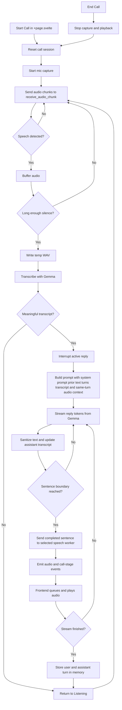

# OpenDuck

OpenDuck is a local voice-call prototype built with a Svelte frontend and a Tauri/Rust backend.
The frontend captures microphone audio and plays streamed speech output.
The backend uses Gemma for reply generation, a selectable STT backend for transcription, and a selectable speech backend for text-to-speech.

## STT Models

The STT card in the app can switch between:

- `Gemma`: uses the loaded Gemma model for transcription. There is no separate STT model to download or load.
- `Whisper Large V3 Turbo`: runs through `mlx-audio` with `mlx-community/whisper-large-v3-turbo-asr-fp16`.

## Speech Models

The speech card in the app can switch between:

- `CSM Expressiva 1B`: the original MLX-based speech model, with optional quantization.
- `Kokoro-82M`: a lighter English TTS backend that runs through `mlx-audio` with the default `af_heart` voice from `mlx-community/Kokoro-82M-bf16`.
- `CosyVoice2-0.5B`: a reference-audio TTS backend that runs through `mlx-audio-plus` using the bundled sample voice.

Use the dropdowns in the STT and speech cards to choose the backends, then download and load the selected models before starting a call. The `Gemma` STT option does not need its own load step.
If you want to use Whisper, Kokoro, or CosyVoice2 in a fresh checkout, run `scripts/setup_python_env.sh` first so the dedicated STT and speech environments install the required `mlx-audio` / `mlx-audio-plus` dependencies.

## Conversation Flow

1. The user starts a call in `src/routes/+page.svelte`. The frontend resets the session, starts microphone capture, and sets the UI to `Listening`.
2. Audio chunks are sent to `receive_audio_chunk` in `src-tauri/src/lib.rs`. The backend uses simple voice activity detection to buffer speech and treat a long enough silence as the end of a turn.
3. The buffered audio is written to a temporary WAV file and sent to the selected STT backend. Empty or filler-only transcripts are ignored.
4. A valid transcript interrupts any active reply, so the user can barge in while the assistant is speaking.
5. The backend asks Gemma for a short spoken reply using the system prompt, recent text conversation history, and the latest detected-turn transcript as the user's exact words, with the matching audio from that same turn attached only as supplemental context for tone, accent, pacing, and background conditions.
6. As Gemma emits text, the backend sanitizes it, updates the visible assistant transcript, and sends each completed sentence to the selected speech worker instead of waiting for the full reply.
7. The frontend listens for assistant text updates plus `csm-audio-start`, `csm-audio-queued`, `csm-audio-chunk`, `csm-audio-done`, and `call-stage` events, queues the generated audio, plays it sequentially, and updates the visible call state.
8. Once the stream finishes, any trailing partial sentence is synthesized, the speech worker context is finalized, and the text transcript plus assistant turn are stored in memory with a rolling limit of 24 turns. The raw audio is only used as live model context for that same turn, while the visible conversation log remains text-only. Starting or ending a call clears that history and resets the session.

## Flowchart

## Key Files

- `src/routes/+page.svelte`: call UI, microphone capture, Tauri event listeners, playback queue, and call-stage state.
- `src-tauri/src/lib.rs`: voice activity detection, transcription, reply generation, conversation memory, and speech worker orchestration.
- `src-tauri/resources/csm_stream.py`: shared speech worker entrypoint for CSM Expressiva 1B, Kokoro-82M, and CosyVoice2-0.5B.
- `src-tauri/resources/stt_stream.py`: dedicated Whisper STT worker entrypoint for `mlx-community/whisper-large-v3-turbo-asr-fp16`.
- `scripts/setup_python_env.sh`: bootstraps the Gemma environment plus separate CSM, Kokoro, CosyVoice, and Whisper STT environments.
