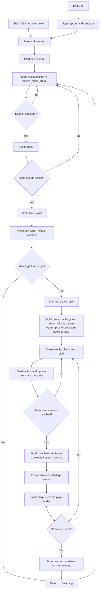

# OpenDuck

Fast, screen-aware, voice-first, local AI assistant for [rubberducking](https://en.wikipedia.org/wiki/Rubber_duck_debugging). Built for Apple Silicon (M1 or later)


## Key Features

🎙️ Real-Time Voice Interaction

Real-Time Conversation: Speak naturally. Interrupt the AI mid-sentence. No "push-to-talk" required.
Voice Cloning: Upload a sample to create custom personas via CosyVoice3 support.
Ultra-Fast TTS: Uses Kokoro-82M for high-quality, lightweight speech that feels human.

👀 Screen-Aware Vision (Use Cases)

Contextual Rubberducking: Use `Shift+Command+L` to capture a screen region and ask: "Why is this code throwing an error?" or "What does this graph mean?"

Accessibility: Be a "Visual Prosthetic". Blind and visually impaired users can use `Shift+Command+Option+L` to have the AI describe any part of their screen in real-time.

🎭 Portability with .openduck

Persona in a Box: Package prompts, custom icons, and voice clones into a single .openduck file. Share your custom characters or expert mentors with one click.

⚡ Engineered for Efficiency

OpenDuck is built with a Rust backend and a Svelte frontend as a native MacOS application.
We chose this stack specifically to maximize Unified Memory for your models. While Electron apps often idle at 500MB+ RAM, OpenDuck stays out of the way. By keeping the app overhead nearly invisible, we ensure that every possible gigabyte of your Mac's RAM is dedicated to running the smartest LLMs possible.

## Quick Start for Installing the Beta Version

1. Go to [Release](https://github.com/anslwy/openduck/releases)
2. Download the latest `openduck-beta-xxx.dmg` and move it to your Applications folder
3. Execute the following in your Terminal:
```
xattr -d com.apple.quarantine /Applications/OpenDuck.app
```
4. Start OpenDuck in your Applications folder

## Development

1. Clone the repository and navigate to the main folder
```
git clone https://github.com/anwlwy/openduck
cd openduck
```

2. Run `start.sh` to start the app (It might take a while to setup the runtime environment for running the first time):
```
./start.sh
```

## STT Models

The STT card in the app can switch between:

- `Gemma`: uses the loaded Gemma model for transcription. There is no separate STT model to download or load.
- `Distil-Whisper`: runs through `mlx-audio` with `distil-whisper/distil-large-v3`.
- `Whisper Large V3 Turbo`: runs through `mlx-audio` with `mlx-community/whisper-large-v3-turbo-asr-fp16`.

## Speech Models

The speech card in the app can switch between:

- `Kokoro-82M`: a lighter English TTS backend that runs through `mlx-audio` with the default `af_heart` voice from `mlx-community/Kokoro-82M-bf16`.
- `Fun-CosyVoice3-0.5B`: the latest reference-audio TTS backend from FunAudioLLM, available in fp16 (highest quality), 8-bit (realistic) and 4-bit (VRAM efficient) versions through `mlx-audio-plus`.
- `CSM Expressiva 1B`: the original MLX-based speech model, with optional quantization.

Use the dropdowns in the STT and speech cards to choose the backends, then download and load the selected models before starting a call. The `Gemma` STT option does not need its own load step.
If you want to use Whisper, Kokoro, or CosyVoice2 in a fresh checkout, run `scripts/setup_python_env.sh` first so the dedicated STT and speech environments install the required `mlx-audio` / `mlx-audio-plus` dependencies.

## Conversation Flow

1. The user starts a call in `src/routes/+page.svelte`. The page coordinates the call state, starts microphone capture, and sets the UI to `Listening`, while the extracted home components render the model cards and popups.
2. Audio chunks are sent to `receive_audio_chunk` in `src-tauri/src/lib.rs`. The backend uses simple voice activity detection to buffer speech and treat a long enough silence as the end of a turn.
3. The buffered audio is written to a temporary WAV file and sent to the selected STT backend. Empty or filler-only transcripts are ignored.
4. A valid transcript interrupts any active reply, so the user can barge in while the assistant is speaking.
5. The backend asks Gemma for a short spoken reply using the system prompt, recent text conversation history, and the latest detected-turn transcript as the user's exact words, with the matching audio from that same turn attached only as supplemental context for tone, accent, pacing, and background conditions.
6. As Gemma emits text, the backend sanitizes it, updates the visible assistant transcript, and sends each completed sentence to the selected speech worker instead of waiting for the full reply.
7. The frontend listens for assistant text updates plus `csm-audio-start`, `csm-audio-queued`, `csm-audio-chunk`, `csm-audio-done`, and `call-stage` events, queues the generated audio, plays it sequentially, and updates the visible call state.
8. Once the stream finishes, any trailing partial sentence is synthesized, the speech worker context is finalized, and the text transcript plus assistant turn are stored in memory with a rolling limit of 24 turns. The raw audio is only used as live model context for that same turn, while the visible conversation log remains text-only. Starting or ending a call clears that history and resets the session.

## Flowchart



## Key Files

- `src/routes/+page.svelte`: top-level page coordinator for call state, audio capture, Tauri event listeners, playback queue, and model actions.
- `src/lib/components/home/*.svelte`: extracted UI sections for the model banners, contacts modal, and conversation popup.
- `src/lib/openduck/*.ts`: shared frontend types, config, contacts storage helpers, model preference helpers, and formatting utilities.
- `src/routes/home.css`: shared styles used by the page and extracted home components.
- `src-tauri/src/lib.rs`: backend runtime coordinator for commands, call flow, transcription, reply generation, conversation memory, and worker orchestration.
- `src-tauri/src/constants.rs`: shared backend constants for models, tray ids, event names, and runtime defaults.
- `src-tauri/src/model_variants.rs`: backend enums and lookup helpers for Gemma, STT, speech model, and voice selection.
- `src-tauri/src/frontend_events.rs`: serialized frontend event payloads plus emit helpers used by the Tauri backend.
- `src-tauri/resources/csm_stream.py`: shared speech worker entrypoint for CSM Expressiva 1B, Kokoro-82M, and CosyVoice2-0.5B.
- `src-tauri/resources/stt_stream.py`: dedicated Whisper STT worker entrypoint for Distil-Whisper and Whisper Large V3 Turbo.
- `scripts/setup_python_env.sh`: bootstraps the Gemma environment plus separate CSM, Kokoro, CosyVoice, and Whisper STT environments.

## Project Structure

The app is now split so the entry files stay focused on orchestration:

- Frontend: `src/routes/+page.svelte` owns the page-level state machine, while `src/lib/components/home/` contains the repeated UI sections and `src/lib/openduck/` contains shared browser-side helpers.
- Backend: `src-tauri/src/lib.rs` remains the main Tauri entry/coordinator, while reusable constants, model-selection enums, and frontend event payloads/helpers live in dedicated Rust modules.

## FAQ

> What is the minimum requirement for RAM?

If you choose `Gemma-4-E2B` for both LLM and STT, then select `Kokoro-82M` for TTS you can get away with ~4GB

> The model is too slow / My Mac does not have enough RAM / Even the E4B model is too dumb to be useful. What should I do?

Use an external LLM server for the LLM.

- [Ollama](https://ollama.com): execute for example `ollama run gemma4:31b-cloud` in your Terminal. The model should then appear in the LLM dropdown in OpenDuck. You can also point OpenDuck at an Ollama instance running on another machine by changing the base URL.
- [LM Studio](https://lmstudio.ai): load your model in LM Studio, start its local server, then select `LM Studio` from the LLM dropdown in OpenDuck. By default OpenDuck expects LM Studio at `http://127.0.0.1:1234`, but you can change the base URL from the config button on the home screen.
- OpenAI-compatible API: point OpenDuck at any endpoint that exposes `/v1/models` and `/v1/chat/completions`, then pick a model from the dropdown. Use a vision-capable model if you want screen captures and pasted images to be sent to the LLM. External provider URLs and API keys are stored in `~/.openduck/config.json`.

> Failed to install some packages / Cannot start the call / There is an error. What to do?

Click "Check for Updates..." (the option under "About OpenDuck") to see if you are on the latest version. If not, try upgrading it to see if it resolves the issue. If the error persists, try pressing "Refresh Caches" to reinstall the runtime environment. If it's still not fixed, you can create an issue and make sure you include your OpenDuck version number, Mac model and the error message (if any)

> How do I find my conversation logs?

They are all located at `~/.openduck/sessions/`

> Where are my external provider settings stored?

Ollama, LM Studio, and OpenAI-compatible API base URLs plus API keys are stored in `~/.openduck/config.json`
